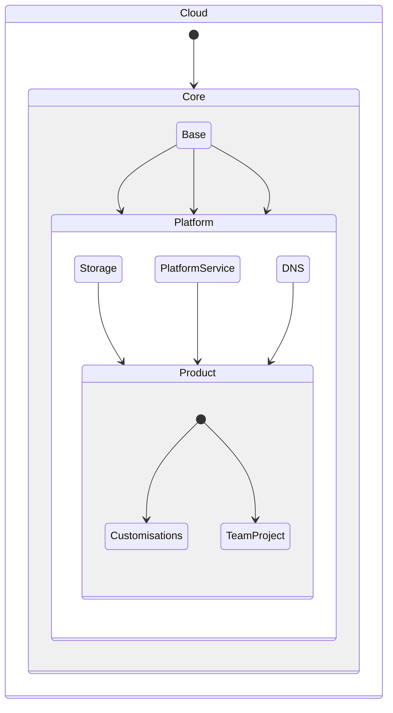

# Infra as Code

## Working with infra-as-code (IaC) in Terraform

We are using a package called [Terraform](https://www.terraform.io/) - for managing our infrastructure as code. It is built by HashiCorp - on top of the Golang/Go programming language. It uses its own declaritive language called HashiCorp Configuration Language ([HCL](https://developer.hashicorp.com/terraform/language/syntax/configuration)).

### Components in Terraform

The main components in Terraform are:

1. `Resources components` are responsible for requesting the provider (like Google) to create the desired resources on your behalf. (and therefore changing state)

1. `Data components` are responsible for pulling what is the current state of a specific resource. In other words, if you want to get the `network_id` of a created resource you can either directly link in terraform or you can indirectly pull it via data components.

1. `Module components` are considered basically functions/classes in terraform. They are responsible for containing multiple resources, data components as well as other modules. You can think them as a function as they contain input variables (params via a `variable.yaml` file, logic via `main.tf` file and exposed variables via `output.yaml` file)

### General information on Terraform setup

Please follow these 12 best practices when creating infrastructural code mentioned below. This will ensure our code follows the best practices and avoids any incosistencies over time - reducing drift, improving security and making it more reusable as possible.

1. `Use remote state` avoid usig any local state other than GCS (Google Cloud Storage, AWS S3 or Azure Buckets to Store state files) - or specialized config databases specific for Terraform.
   This can be managed via the [folder](./gcp/core/terraform/terraform_buckets/main.tf) built to manage the state of all the sub-project components.

2. `Use existing modules or trusted community modules` when possible. This ensure that we avoid creating similar functions for the same resources. The only exception to this rule (which will be mentioned below) is to reuse components across different terraform layers.

3. `Avoid variables hard-coding` - make sure these variables are passed in as parameters (in the case of variable files), or pulled from data components to avoid inconsistencies and having to change values across multiple files.

4. `Consistent naming convention` is a must to ensure the code is readible by all users. So the following rules should be followed:

- Use underscores(\_) as a separator and lowercase letters in names (snakecase).
- Try not to repeat the resource type in the resource name.
- For single-value variables and attributes, use singular nouns. For lists or maps, -use plural nouns to show that it represents multiple values.
- Always use descriptive names for variables and outputs, and remember to include a description, defaults and add comments to help others use your variables.

5. `Tag your Resources` - irrespective of which cloud you are building for, all clouds allow tagging for its resources and it helps with cost assignment, management, environment allocation and even security policies.

- All resources must have an `env` tag which is either ['prod', 'nonprod', 'dev']
- All resources must have a `team` tag which is either team name associated. If multiple seperate them by comma (data_platform,freight_search) or for special cases 'global' (for platform resources). [It is considered a platform if more it is a self serve tool that multiple team use like networking, monitoring, and logs]
- All resources must have a `layer` tag which denotes which layer of the infrastructure it refers to, which can either be ['core', 'platform', 'product'].
- All resources must have a `managed_by` tag which is either ['infra-as-code', 'manual', or None (if not via terraform)]

6. `Always use secret managers` - never hard-code any secrets or expose them in any shape or form. All these should be stored in Secret Managers (or Github Secrets for CICD specifically). This is pre-setup based on cloud folder so no need to make changes.

7. `Test your Terraform code` - terraform provide many ways to statically test your code before pushing or performing a plan. `terraform validate` is one method to test your code that anyone can perform as well as testing your code in staging (creating diffs to staging/\* branches)

8. `Build modules wherever possible` as they will help make your code DRYer (Do not repat yourself) avoiding duplication and helping others with their tasks too. Again, as mentioned above, the only exception is reusing modules across terraform layers.

9. `Use loops and conditionals` like as if you were writing any other programming language. This ensures you do not need to repeat yourself and helps with ensuring that testing your code is easier. It might be intimidating in the beginning, but it helps ALOT in the long-run. This also means that you may use `dynamic blocks` to assist you here.

10. Always `Use variables validations` - this feature is a feature that might be missing in a few programming languages themselves as it validates the parameters inputed into a function. They help at plan (build) stage catching any errors as well as helps with self-documenting code - letting the user of the module know what are the options or how it is checked.

11. `Leverage Helper tools to make your life easier`

- tflint – Terraform linter for errors that the plan can’t catch.
- terraform-docs – Quickly generate docs from modules

> > [Other tools already backed in to help you are]:

- digger – Workflow for collaborating on Terraform projects
- terraform-cost-estimation/infracost – cost estimation service for your plans
- opa - for policy as code checks against your plans

12. Last but not least, `Take advantage of the IDE extensions`. Vscode for example has an amazing extension created by HashiCorp that gives language server features to your code, letting you know which variables are available, what the description says and much more.

### Architecture

```bash
- gcp
- azure
- global
- onprem
```

The first layer is responsible for seperating configurations based on cloud provider (as well as on-prem resource). As there are different CICD pipelines for each, and authentication differeces as well as completely different providers it makes sense to seperate them based on cloud.

Inside each cloud provider is where we implement a layer approach to our architecture. This means, that each layer will have its own state file and their own modules folder (which will contain all resources used accross different resource in the same layer). It is similar to a utils/common folder in other programming languages.

The layers are as follows:

```bash
- gcp
|
| - core
|   | - project_setup
|   | - artifact
| - platform
|   | - gke
|   | - cloud_composer
|   | - bigquery
| - product
    | - uf_load
    | - bigquery_allocation
    | - gke_permissions
```

> One exception to this is a folder called base (also known as org level configs) - it is supposed to handle the creation of the architecture (core, platform, product) and handle any bucket creation for terraform separation + any org level management.
> Essentially, if there are environments or it needs a project to be built to be used, the it should not belong in base.

## Enforced Communication Between Layers

This has to be follow at all cost for CICD pipelines to work properly and avoid state drift



What this means is that the layers are acyclycal and can ONLY use the previous layer as reference to build your components. This ensures that we only need to run `terraform plan` on the downstream dependencies if an upper layer is modified.
i.e. If A platform tool like GKE (kubernetes) is modified then it should trigger a `terraform plan` on the same layer (layer 1 / platform layer) and all downstream layers (layer 2 / application layer, in this case), but not on Layer 0 / Core Layer.
Running a `plan` does not mean it will rebuild a resource and make any changes, but that is the only way to check if something needs to be changed.

### Layer references (breakdown)

Layer 0 - also denoted `core` should contain resources/modules that can be spun up by themselves without any other dependencies that are not project specific but rather help guarantee platform developers can build the tools.
A few examples are:

- VNETs
- Subnets
- KeyVault
- Identities
- Public IPs
- Project/Folder Creation

Layer 1 - also denoted `platform` should contains resource/modules that spins up resources to be used by multiple teams and application developers. These normally are team agnostic.

- GKE - Google Kubernetes Engine
- Cloud Composer (Apache Airflow)
- Monitoring Services
- Alert Services
- Redis as a Service

Layer 2 - also denoted `product` layer should contain resource/modules that spins up resources to be used by a team or service team. These resource and configurations are team/service specific.

- Deploy Service to Terraform (fmd, for example)
- Configure BigQuery project allocations
- Role assignments
- Storage configurations (or getting a database for the service spun up)

### But how do I run terraform plan/apply on the code?

You DO NOT need to do it yourself, Atlantis will take care of the CICD pipelining for you and will run terraform plan/apply on your behalf.

[How to run Terraform Plan/Apply](/digger/)

Just need to remember `digger plan` and `digger apply` through Github comments and you are good to go.

### Is my code deployed/applied to GCP?

Like any other development process, we follow the similar practise with a simple tweak. Below is the setup to apply pipleine: 
- Clone and checkout code at your local machine with the right branch name { refer: [branch name rules](https://github.com/uber-freight-internal/code/settings/rules/476697) }
- Make the necessary edits per your plan. 
- Validate locally refer the below section.
- Do the git rituals-add,commit, remote push, raise PR.
- Wait for git actions: follow the digger run report- it shows the `terraform plan` output.
- Get code-reviewer approvals. 
- Ensure all checks are passed for the PR, if failed troubleshoot & seek help.
- Once, all checks are passed, comment on the PR `digger apply`, so the git-actions will deploy/apply the changes to GCP environment. 
- Once the apply is sucessful, hit the 'Merge` in the PR.

*Make sure you don’t forget the `digger apply` step, otherwise even though your code has been merged it won’t actually be live.*

## How do I run a terraform validate (to test my code) locally without authentication?

Because `terraform validate` requires running `terraform init` - and this command requires authentication, users would need access to secret variables to connect to GCP. The alternative way found is to run `terraform init` with `backend=false` forcing it to download providers, but not connection externally to the backend state file.

Command example:

```bash
# terraform -chdir=<path_to_project> init -backend=false
terraform -chdir=terraform/gcp/dev/platform/bigquery init -backend=false
```

Now, with that ran successfully, we create the .terraform and .terraform.lock.hcl files locally - so you can now run a validate, as such:

```bash
# terraform -chdir=<path_to_project> validate
terraform -chdir=terraform/gcp/dev/platform/bigquery validate
```

## How to create a new project in GCP through terraform?
You can add a new entry for a GCP project in the `terragrunt.hcl` file, following the structure of existing projects. Here are some key points to remember:

* **ID:**
    * Lowercase characters separated by hyphens (`-`).
    * Globally unique within GCP, so it must start with the prefix `uf-`.
    * Cannot include an environment postfix as that will be specified in the `environments` section.
* **Team:** Reference a team name that exists in the `teams.yaml` file.
* **Environments:** Specify configurations for each environment you want to create the project under. Current environment options are `prod`, `nonprod`, and `dev`.
* **Monthly Budget:** Define a budget for the project.

---

## Module Design Philosophy: When to Create a New Module

A core principle of maintaining a healthy and scalable infrastructure codebase is knowing when to modify an existing Terraform module versus when to create a new one. While our goal is often to keep our code DRY (Don't Repeat Yourself), for infrastructure, **safety, predictability, and clarity are more important than avoiding code duplication.**

### The "Swiss Army Knife" vs. the "Dedicated Toolbox"

It can be tempting to create a single, highly-flexible module that handles many different use cases with complex conditional logic (a "Swiss Army Knife"). However, this approach often leads to modules that are difficult to understand, fragile to change, and prone to causing unintended side effects.

Instead, we should prefer a "Dedicated Toolbox" approach. This means creating separate, specialized modules for scenarios that have fundamentally different resource requirements or behaviors.

A good rule of thumb is:

*   **EDIT** an existing module when you are adding a small, backwards-compatible feature or exposing a new variable.
    *   *Good Example:* Adding a `timeout_sec` variable to a backend service that was previously hard-coded.
    *   *Good Example:* Adding the ability to set a new, optional tag on a resource.

*   **CREATE** a new module when the change alters the core resources or introduces a significant behavioral divergence.
    *   *Good Example:* Creating a load balancer that supports a new backend type with different requirements.
    *   *Good Example:* Creating a database module for a different engine (e.g., Postgres vs. MySQL) that has different configuration options.

### A Real-World Example: GLB Modules

We recently encountered a perfect example of this principle with our Global Load Balancer (GLB) modules.

1.  **The Original Module (`glb-f5`):** This module was designed to provision a GLB with backends that support and require a `google_compute_health_check`. This works perfectly for Hybrid NEGs.

2.  **The New Requirement:** A new use case required a GLB with an **Internet NEG** as a backend. The Google Cloud provider **does not allow** health checks to be attached to backend services that use Internet NEGs.

3.  **The Wrong Approach (and its failures):** The initial attempt was to modify the existing `glb-f5` module to conditionally include the health check. This led to a series of problems:
    *   It required complex conditional logic (`count`, ternary operators) that made the code harder to read.
    *   It caused Terraform state refactoring issues, creating confusing plans even when no infrastructure was changing.
    *   It ultimately resulted in provider errors (`resourceInUseByAnotherResource`) because Terraform struggled to manage the delicate dependency between the backend service and its health check during updates.

4.  **The Correct Approach (and its benefits):** The solution was to create a new, separate module: `glb-f5-internet`.
    *   The original `glb-f5` module was left untouched, guaranteeing the safety and stability of all existing GLBs. **The blast radius of the change was zero.**
    *   The new `glb-f5-internet` module was created by copying the original and simply **deleting** the health check resources.
    *   The resulting modules are simple, have clear purposes, and are not burdened with complex logic.

### Conclusion

While this approach resulted in an additional module folder, the gains in safety, predictability, and maintainability are invaluable. When faced with a similar decision, please prioritize stability and clarity over consolidating modules. This helps us build a more robust and resilient infrastructure that is easier and safer for the entire team to work with.
