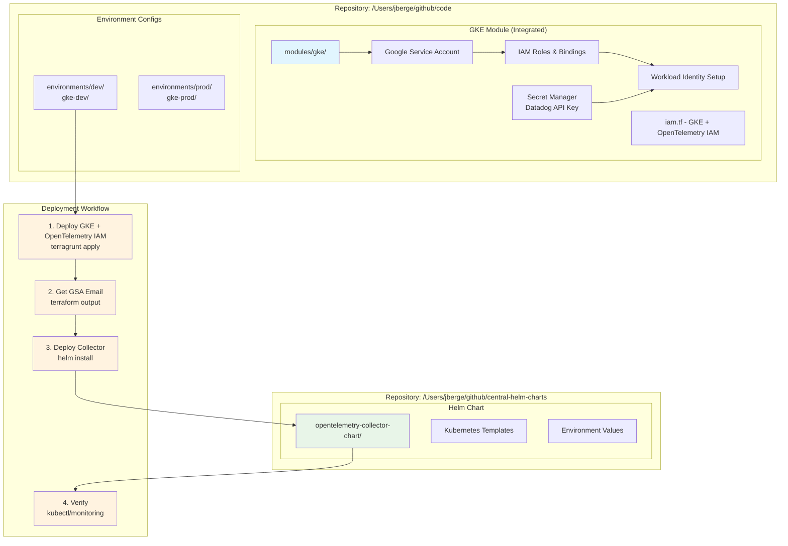

# OpenTelemetry Collector Helm Chart Implementation Guide

This document provides a comprehensive guide for implementing the OpenTelemetry Collector using the new Helm chart approach, replacing the previous all-in-one Terraform implementation. The Helm chart follows [Google's official best practices](https://cloud.google.com/stackdriver/docs/instrumentation/opentelemetry-collector-gke) for optimal performance and reliability.

## Overview

The new implementation separates infrastructure and application concerns with Google Cloud optimizations:

- **🏗️ Infrastructure (IAM)**: Integrated into GKE module in `/Users/jberge/github/code`
- **🚀 Application (Kubernetes)**: Managed by Helm in `/Users/jberge/github/central-helm-charts` with Google Cloud best practices

## Architecture



## Benefits of Helm Approach

### ✅ **Improved Separation of Concerns**
- **Infrastructure**: Google Cloud IAM, Service Accounts, Workload Identity
- **Application**: Kubernetes resources, configurations, deployments

### ✅ **Better Kubernetes Integration**
- Native Helm templating instead of `kubernetes_manifest`
- Proper Kubernetes resource lifecycle management
- Built-in validation and rollback capabilities

### ✅ **Enhanced Operations**
- Easy upgrades: `helm upgrade`
- Quick rollbacks: `helm rollback`
- Environment management with values files
- GitOps-friendly with ArgoCD/Flux

### ✅ **Community Alignment**
- Follows Kubernetes best practices
- Easier integration with monitoring stacks
- Standard Helm chart patterns

### ✅ **Google Cloud Optimizations**
- Uses Google-built OpenTelemetry Collector image with GCP optimizations
- Optimized batching (5s timeout, 512 entries) for Google Cloud APIs
- Automatic resource detection for GCP labels (`project_id`, `cluster_name`)
- Google-recommended processor sequence for optimal performance
- Enhanced security with Workload Identity integration

## Implementation Guide

### Step 1: Deploy Infrastructure (Terraform)

#### Development Environment
```bash
# Navigate to the GKE dev environment (includes OpenTelemetry IAM)
cd /Users/jberge/github/code/src/terraform/gcp/projects/uf-compute/environments/dev/gke-dev

# Deploy GKE cluster with OpenTelemetry IAM resources
terragrunt plan
terragrunt apply

# Get the OpenTelemetry service account email for Helm
export GSA_EMAIL=$(terragrunt output -raw opentelemetry_service_account_email)
echo "OpenTelemetry Service Account: $GSA_EMAIL"
```

#### Production Environment
```bash
# Navigate to production GKE environment
cd /Users/jberge/github/code/src/terraform/gcp/projects/uf-compute/environments/prod/gke-prod

# Create Datadog secret manually first (if needed)
echo -n "YOUR_DATADOG_API_KEY" | gcloud secrets create datadog-api-key \
  --project=uf-compute-p \
  --data-file=-

# Deploy GKE with OpenTelemetry integration enabled
terragrunt apply

# Get OpenTelemetry service account output
export GSA_EMAIL=$(terragrunt output -raw opentelemetry_service_account_email)
```

### Step 2: Deploy Application (Helm)

#### Development Deployment
```bash
# Deploy OpenTelemetry Collector in development
helm install otel-collector-dev \
  /Users/jberge/github/central-helm-charts/opentelemetry-collector-chart \
  --namespace opentelemetry \
  --create-namespace \
  --values /Users/jberge/github/central-helm-charts/opentelemetry-collector-chart/values-dev.yaml \
  --set serviceAccount.annotations."iam\.gke\.io/gcp-service-account"="$GSA_EMAIL"
```

#### Production Deployment
```bash
# Deploy OpenTelemetry Collector in production with Datadog
helm install otel-collector-prod \
  /Users/jberge/github/central-helm-charts/opentelemetry-collector-chart \
  --namespace opentelemetry \
  --create-namespace \
  --values /Users/jberge/github/central-helm-charts/opentelemetry-collector-chart/values-prod.yaml \
  --set serviceAccount.annotations."iam\.gke\.io/gcp-service-account"="$GSA_EMAIL" \
  --set exporters.datadog.enabled=true
```

### Step 3: Verification

```bash
# Check deployment status
helm list -n opentelemetry
kubectl get pods -n opentelemetry

# Check service account configuration
kubectl describe serviceaccount -n opentelemetry opentelemetry-collector

# Test OTLP endpoints
kubectl port-forward -n opentelemetry svc/opentelemetry-collector 4317:4317 4318:4318

# Check collector logs
kubectl logs -n opentelemetry -l app.kubernetes.io/name=opentelemetry-collector
```

## Configuration Management

### Environment-Specific Values

#### Development (`values-dev.yaml`)
```yaml
global:
  projectId: "uf-compute-p"
  clusterName: "gke-dev"
  clusterLocation: "us-south1"

mode: daemonset
config:
  logLevel: debug  # Verbose logging for development
  
resources:
  limits:
    cpu: 500m      # Smaller resources for cost efficiency
    memory: 1Gi
    
exporters:
  googleCloud:
    enabled: true
  datadog:
    enabled: false  # Disabled in dev by default
```

#### Production (`values-prod.yaml`)
```yaml
global:
  projectId: "uf-compute-p"
  clusterName: "gke-prod"
  clusterLocation: "us-south1"

mode: daemonset
config:
  logLevel: info   # Production logging level
  
resources:
  limits:
    cpu: 2000m     # Higher resources for production load
    memory: 4Gi
    
exporters:
  googleCloud:
    enabled: true
  datadog:
    enabled: true   # Enable Datadog in production
    
podDisruptionBudget:
  enabled: true     # High availability
```

### Dynamic Configuration

Use Helm's templating for dynamic configuration:

```bash
# Set cluster-specific values
helm upgrade otel-collector \
  /Users/jberge/github/central-helm-charts/opentelemetry-collector-chart \
  --set global.clusterName=$(kubectl config current-context) \
  --set global.projectId=$(gcloud config get-value project)
```

## Integration with CI/CD

### GitOps Workflow

```yaml
# .github/workflows/deploy-opentelemetry.yml
name: Deploy OpenTelemetry Collector

on:
  push:
    branches: [main]
    paths: 
      - 'environments/*/gke-*/**'

jobs:
  deploy-infrastructure:
    runs-on: ubuntu-latest
    steps:
      - name: Deploy GKE with OpenTelemetry IAM
        run: |
          cd src/terraform/gcp/projects/uf-compute/environments/${{ matrix.env }}/gke-${{ matrix.env }}
          terragrunt apply -auto-approve
          
      - name: Get OpenTelemetry Service Account
        id: gsa
        run: echo "email=$(terragrunt output -raw opentelemetry_service_account_email)" >> $GITHUB_OUTPUT
        
    outputs:
      gsa_email: ${{ steps.gsa.outputs.email }}
      
  deploy-application:
    needs: deploy-infrastructure
    runs-on: ubuntu-latest
    steps:
      - name: Deploy Helm Chart
        run: |
          helm upgrade --install otel-collector \
            /Users/jberge/github/central-helm-charts/opentelemetry-collector-chart \
            --namespace opentelemetry \
            --create-namespace \
            --values values-${{ matrix.env }}.yaml \
            --set serviceAccount.annotations."iam\.gke\.io/gcp-service-account"="${{ needs.deploy-infrastructure.outputs.gsa_email }}"
```

### ArgoCD Integration

```yaml
# argocd/opentelemetry-collector.yaml
apiVersion: argoproj.io/v1alpha1
kind: Application
metadata:
  name: opentelemetry-collector
  namespace: argocd
spec:
  project: default
  source:
    repoURL: https://github.com/uber-freight-internal/central-helm-charts
    path: opentelemetry-collector-chart
    targetRevision: HEAD
    helm:
      valueFiles:
        - values-prod.yaml
      parameters:
        - name: serviceAccount.annotations.iam\.gke\.io/gcp-service-account
          value: "gke-prod-otel-collector@uf-compute-p.iam.gserviceaccount.com"
  destination:
    server: https://kubernetes.default.svc
    namespace: opentelemetry
  syncPolicy:
    automated:
      prune: true
      selfHeal: true
    syncOptions:
      - CreateNamespace=true
```

## Migration Status - ✅ COMPLETED

### Integration Summary

The OpenTelemetry IAM functionality has been **successfully integrated** into the GKE module:

✅ **Completed Migration Steps:**
1. **IAM Integration**: OpenTelemetry IAM resources moved to `modules/gke/iam.tf`
2. **Module Consolidation**: Standalone `opentelemetry-iam` module removed
3. **Environment Updates**: Dev environment updated to use integrated GKE module
4. **Configuration Updates**: OpenTelemetry variables added to GKE module
5. **Output Updates**: OpenTelemetry outputs available from GKE module

### New Architecture Benefits

✅ **Simplified Deployment**: Single `terragrunt apply` for GKE + OpenTelemetry IAM  
✅ **Reduced Complexity**: No separate OpenTelemetry IAM provisioning step  
✅ **Centralized Management**: All GKE-related IAM in one place  
✅ **Consistent Configuration**: Unified variable management  

### For Existing Deployments

If you have existing OpenTelemetry deployments using the old module:

```bash
# 1. Update your environment configuration to enable OpenTelemetry in GKE module
cd /path/to/your/gke-environment
# Add to terragrunt.hcl:
# enable_opentelemetry = true
# opentelemetry_namespace = "opentelemetry"
# opentelemetry_service_account_name = "opentelemetry-collector"

# 2. Apply the updated configuration
terragrunt apply

# 3. Get the new service account email
export GSA_EMAIL=$(terragrunt output -raw opentelemetry_service_account_email)

# 4. Update your Helm deployment to use the new service account
helm upgrade otel-collector \
  /Users/jberge/github/central-helm-charts/opentelemetry-collector-chart \
  --set serviceAccount.annotations."iam\.gke\.io/gcp-service-account"="$GSA_EMAIL"
```

## Operational Procedures

### Daily Operations

#### Viewing Logs
```bash
# Collector logs
kubectl logs -n opentelemetry -l app.kubernetes.io/name=opentelemetry-collector

# Follow logs in real-time
kubectl logs -n opentelemetry -l app.kubernetes.io/name=opentelemetry-collector -f
```

#### Monitoring Health
```bash
# Check pod status
kubectl get pods -n opentelemetry

# Check service endpoints
kubectl get svc -n opentelemetry

# Port forward for local testing
kubectl port-forward -n opentelemetry svc/opentelemetry-collector 4317:4317
```

#### Configuration Updates
```bash
# Update configuration
helm upgrade otel-collector \
  /Users/jberge/github/central-helm-charts/opentelemetry-collector-chart \
  --values values-prod.yaml \
  --set config.logLevel=debug

# View current configuration
helm get values otel-collector -n opentelemetry
```

### Troubleshooting

#### Common Issues

1. **Workload Identity Problems**
   ```bash
   # Check service account annotations
   kubectl describe sa -n opentelemetry opentelemetry-collector
   
   # Verify IAM binding
   gcloud iam service-accounts get-iam-policy gke-dev-otel-collector@uf-compute-p.iam.gserviceaccount.com
   ```

2. **Secret Access Issues**
   ```bash
   # Check SecretProviderClass
   kubectl describe secretproviderclass -n opentelemetry
   
   # Verify secret mount
   kubectl exec -n opentelemetry deployment/opentelemetry-collector -- ls -la /var/secrets/datadog
   ```

3. **Configuration Problems**
   ```bash
   # Validate Helm chart
   helm lint /Users/jberge/github/central-helm-charts/opentelemetry-collector-chart
   
   # Dry run upgrade
   helm upgrade otel-collector \
     /Users/jberge/github/central-helm-charts/opentelemetry-collector-chart \
     --dry-run --debug
   ```

### Maintenance

#### Upgrades
```bash
# Update collector image version
helm upgrade otel-collector \
  /Users/jberge/github/central-helm-charts/opentelemetry-collector-chart \
  --set image.tag=0.132.0

# Rollback if needed
helm rollback otel-collector 1
```

#### Scaling
```bash
# Scale deployment (if using deployment mode)
helm upgrade otel-collector \
  /Users/jberge/github/central-helm-charts/opentelemetry-collector-chart \
  --set replicaCount=5

# Update resources
helm upgrade otel-collector \
  /Users/jberge/github/central-helm-charts/opentelemetry-collector-chart \
  --set resources.limits.cpu=1000m \
  --set resources.limits.memory=2Gi
```

## Security Considerations

### Access Control
- IAM roles follow principle of least privilege
- Workload Identity prevents service account key usage
- Namespace isolation with RBAC
- Secret Manager integration for sensitive data

### Network Security
- ClusterIP service type (internal only)
- Network policies for traffic restriction
- TLS encryption for external endpoints
- Pod security contexts with non-root users

### Compliance
- All resources tagged with appropriate labels
- Audit logging enabled through Google Cloud
- Secret rotation capabilities via Secret Manager
- Regular security scanning of container images

## Performance Tuning

### Resource Optimization
```yaml
# High-performance configuration
resources:
  limits:
    cpu: 4000m
    memory: 8Gi
  requests:
    cpu: 1000m
    memory: 2Gi

config:
  batch:
    timeout: "5s"
    sendBatchSize: 2000
    sendBatchMaxSize: 2000
```

### Monitoring Metrics
Key metrics to monitor:
- `otelcol_process_uptime`
- `otelcol_process_memory_rss`
- `otelcol_receiver_accepted_spans_total`
- `otelcol_exporter_sent_spans_total`
- `otelcol_exporter_send_failed_spans_total`

## Support and Documentation

### Additional Resources
- [Helm Chart README](/Users/jberge/github/central-helm-charts/opentelemetry-collector-chart/README.md)
- [GKE Module README](/Users/jberge/github/code/src/terraform/gcp/projects/uf-compute/modules/gke/README.md)
- [OpenTelemetry Documentation](https://opentelemetry.io/docs/)
- [Google Cloud OpenTelemetry](https://cloud.google.com/trace/docs/setup/opentelemetry)

### Getting Help
1. Check the troubleshooting section above
2. Review Helm chart and GKE module documentation
3. Check collector logs for error messages
4. Verify Google Cloud IAM permissions
5. File issues in the appropriate repository

This implementation provides a robust, scalable, and maintainable approach to OpenTelemetry Collector deployment that aligns with Kubernetes and cloud-native best practices.
